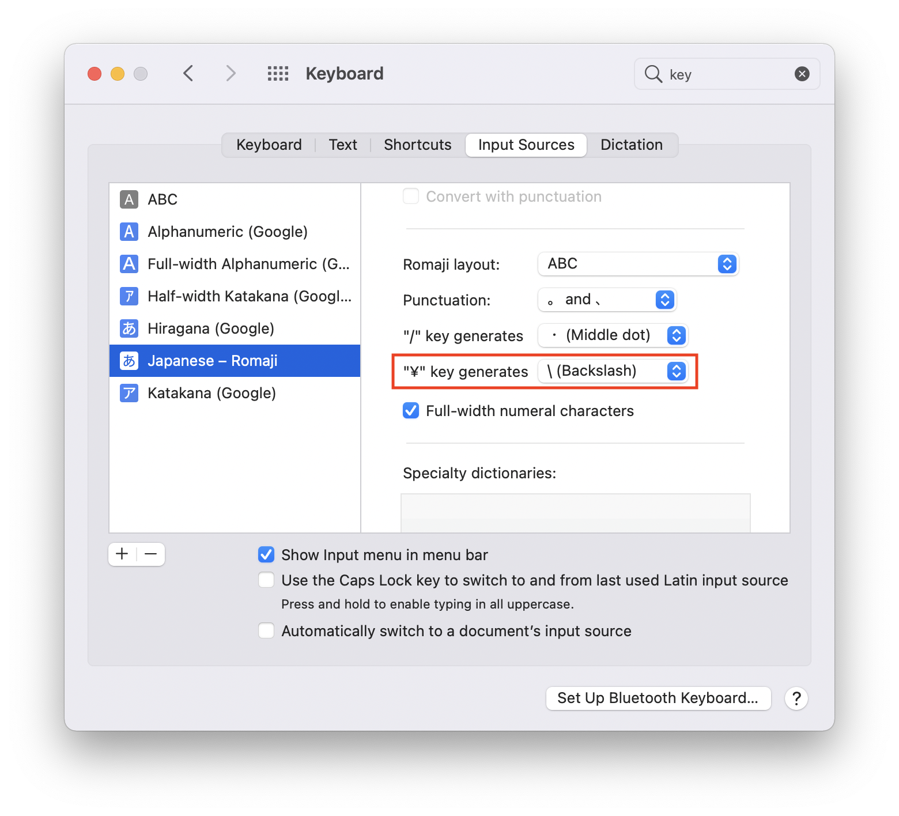
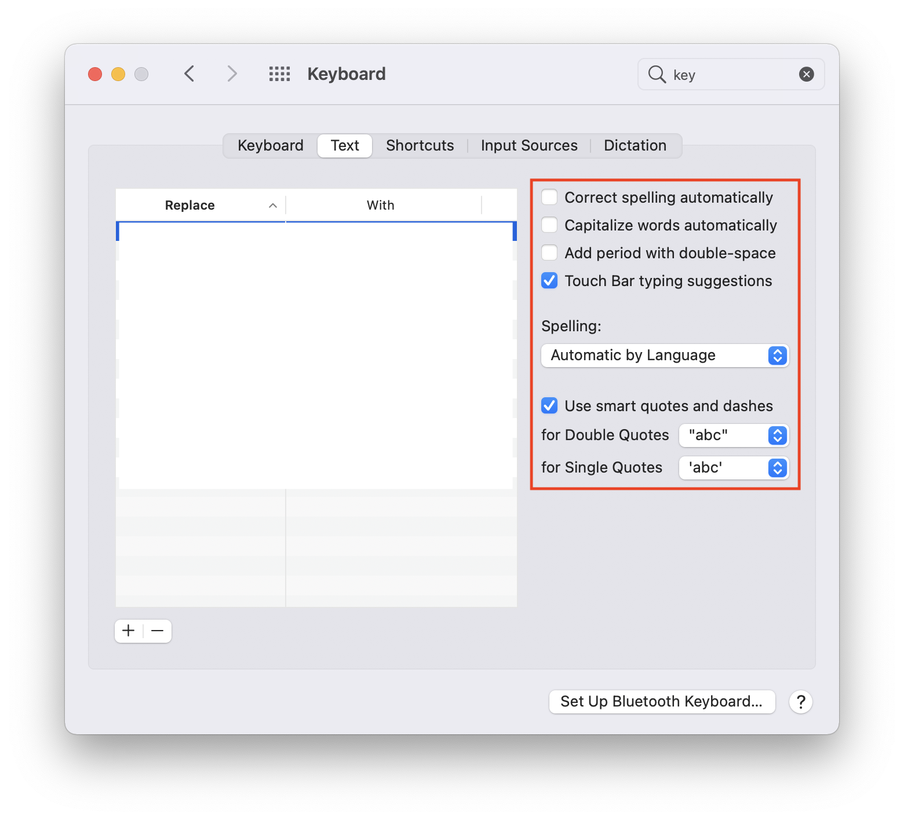
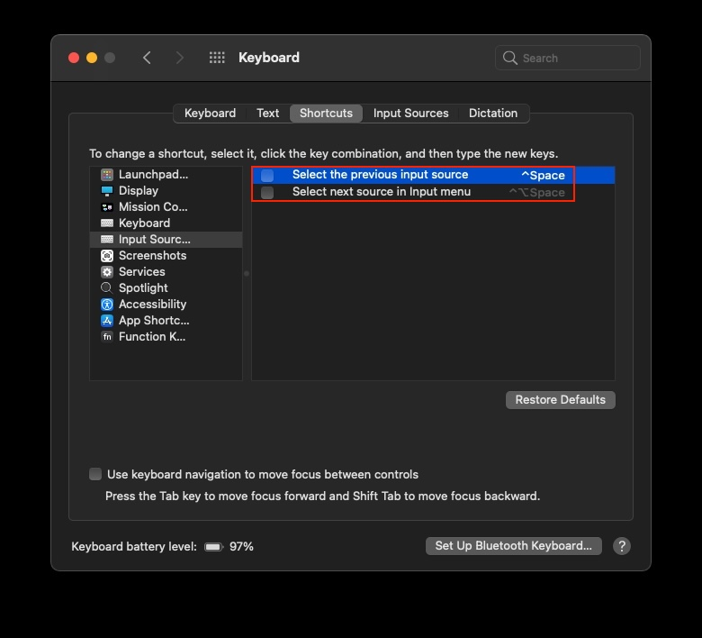

# Setup New Mac

Mac を買ったら最初にすること

- setting to System Preferences

  - setup trackPad
    - "タップでクリック"を有効化
    - "スクロールの方向:ナチュラル"を無効化
  - change language(ja->en)
    - 設定 > 言語と地域 > "優先する言語"に英語を追加し、先頭に配置 （再起動）

- generate ssh-key(and add key to Github)

## Xcode command line tool をインストール

```
xcode-select --install
```

## put dotfiles, create symblic links

```sh
git clone git@github.com:kyohei8/dotfiles.git
```

```sh
zsh bootstrap.sh
```

## istall Homebrew, and install packages

```sh
brew bundle
#Finderを一旦落とす(quicklookを反映するため)
defaults write com.apple.finder QLEnableTextSelection -bool true && killall Finder
```

- Manual install
  - Hosts
    <https://github.com/specialunderwear/Hosts.prefpane/downloads>
  - [z](https://github.com/rupa/z)

## Keyboard Settings

### disable the Character Accent Menu

```sh
defaults write -g ApplePressAndHoldEnabled -bool false
```

#### '\' key generate '\' (not '¥')

System Preferences > Keybord > inputSource



System Preferences > Keybord > Text



fixed Ctrl+Space behavior



# Turn off animations

```bash
# Turn off Quick Look pop-out animations
$ defaults write com.apple.finder QLPanelAnimationDuration -int 0
$ killall Finder

# Turn off Mission Control animations
$ defaults write com.apple.dock expose-animation-duration -float 0
# Turn off Launchpad animations
$ defaults write com.apple.dock springboard-show-duration -float 0
$ defaults write com.apple.dock springboard-hide-duration -float 0
$ defaults write com.apple.dock springboard-page-duration -float 0
# Turn off Dock hiding animations
$ defaults write com.apple.dock autohide-delay -float 0
$ defaults write com.apple.dock autohide-time-modifier -int 0
# then
$ killall Dock

# opening and closing windows and popovers
$ defaults write -g NSAutomaticWindowAnimationsEnabled -bool false
# disable smooth scrolling
$ defaults write -g NSScrollAnimationEnabled -bool false
# Turn off resize animations
$ defaults write -g NSWindowResizeTime -float 0.001
$ defaults write -g NSDocumentRevisionsWindowTransformAnimation -bool false
# Turn off full screen animations
$ defaults write -g NSToolbarFullScreenAnimationDuration -float 0
# disable finder animations
$ defaults write com.apple.finder DisableAllAnimations -bool true
#(then reboot or logout your mac)
```

## Screencapture to jpg

```sh
defaults write com.apple.screencapture type jpg
```

## other

git settings

```
git config --global core.ignorecase true
```
